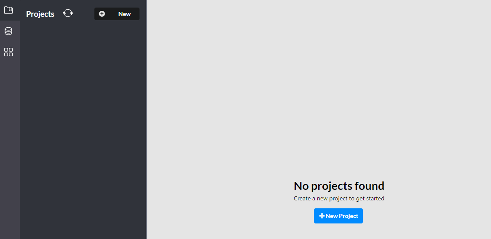
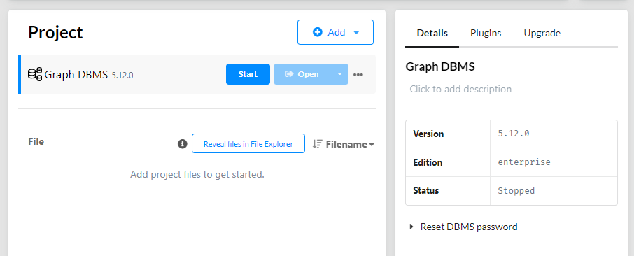

# How to use the graph database:

## Step 1:
Download the Neo4j Desktop application from this [link](https://neo4j.com/download/neo4j-desktop/?edition=desktop&flavour=winstall64&release=1.5.9&offline=true). This is for Windows, for other OS it might differ.

## Step 2:
After downloading the execution file, follow the installation guide.

## Step 3:
Run the Neo4j Desktop application and create a project. To make this easy, here are some screenshots:

***

***

## Step 4: 
Run the *create_data.py* file to create the data.

## Step 5:
Run the *connection.py* file to see the time each action takes. The password in the connection string should what you gave for your database.